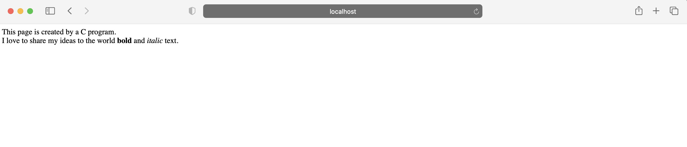

# Build
```
# docker build -t my-apache2 .
# docker run -dit --name my-running-app -p 8080:80 my-apache2
```

# Curl
```
curl localhost:8080/cgi-bin/index.out
```

# Response
```
<html><head><title>C-Html sync</title></head><body>This page is created by a C program.<br />I love to share my ideas to the world <strong>bold</strong> and <em>italic</em> text.</body> </html>
```

# View


# Visit (To See Parameter Use)

http://localhost:8080/cgi-bin/q.out?color=blue&user=mike


